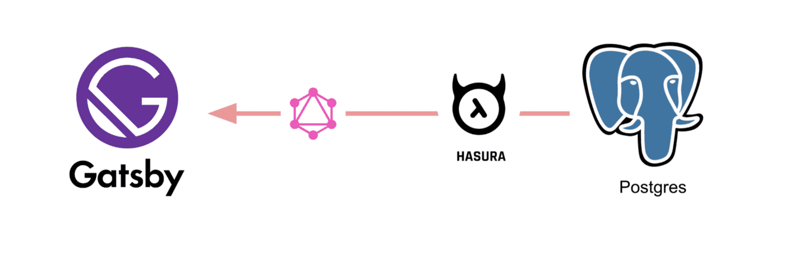

# gatsby-postgres-graphql

Boilerplate to get started with Gatsby, Hasura GraphQL engine as CMS and postgres as database using the awesome plugin [gatsby-source-graphql](https://github.com/gatsbyjs/gatsby/tree/master/packages/gatsby-source-graphql).

